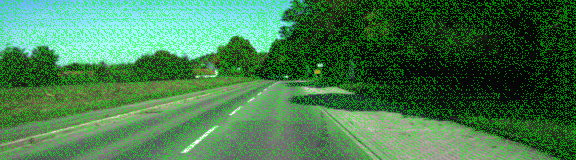
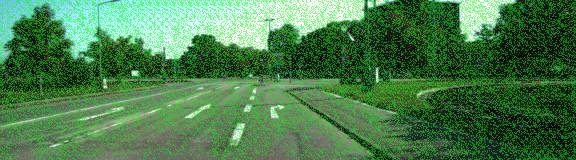
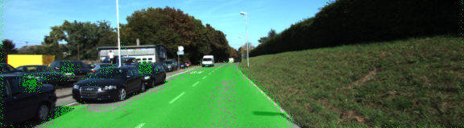
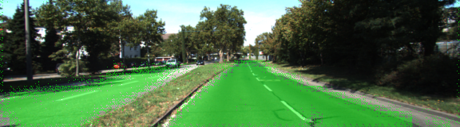
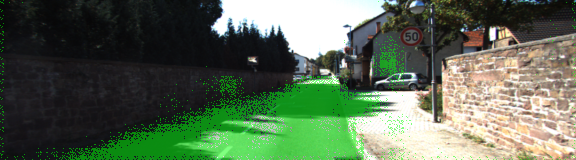
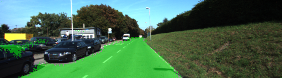
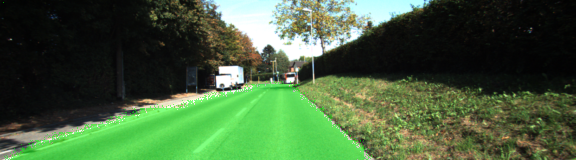
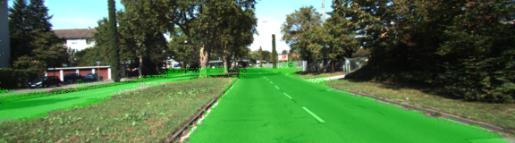
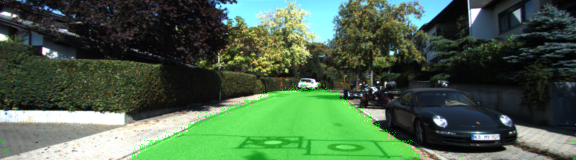

# CarND-Semantic-Segmentation-P2
Udacity Self-Driving Car Nanodegree - Semantic Segmentation Project

# Overview

The object of this project is to label the pixels of a road image using the Fully Convolutional Network (FCN) described in the [Fully Convolutional Networks for Semantic Segmentation](https://people.eecs.berkeley.edu/~jonlong/long_shelhamer_fcn.pdf) by Jonathan Long, Even Shelhamer, and Trevor Darrel. The project is based on the starting project provided by Udacity in [this repo](https://github.com/udacity/CarND-Semantic-Segmentation).

# Prerequisites

Based on Udacity's start project the following frameworks and packages should be installed to execute the code:

- [Python 3](https://www.python.org/)
- [TensorFlow](https://www.tensorflow.org/)
- [NumPy](http://www.numpy.org/)
- [SciPy](https://www.scipy.org/)

I provide an environment configuration on [environment.yml](./environment.yml) in order to reproduce the package selection. I used it to make sure the basic of the code was working properly, but without access to a local GPU, the code ran too slow. To run code properly, I created a Spot instance on AWS following the procedure explained in the class with the Udacity's udacity-cardnf-advanced-deep-learning Comunity AMI. The instance type was `g3.4xlarge`. The only package I have to install manually was (tqdm)[https://pypi.python.org/pypi/tqdm].

The dataset used in this project is the [Kitti Road dataset](http://www.cvlibs.net/datasets/kitti/eval_road.php). It could be download from [here](http://www.cvlibs.net/download.php?file=data_road.zip) or use the script [download_images.sh](./data/download_images.sh).

# Code description

Most of the code is inside [`main.ipynb`](./main.ipynb). 
I used Alicloud, which does not allow me to download anything from S3, so I downloaded the VGG16 model first and upload to the cloud server.

The code then extracts the input, keep probability, layer 3, layer 4 and layer 7 from it (method `load_vgg`). Those layers are used in the `layers` function  to create the rest of the network:

- One convolutional layer with kernel 1 from VGG's layer 7.
- One deconvolutional layer with kernel 4 and stride 2 from the first convolutional layer.
- One convolutional layer with kernel 1 from VGG's layer 4.
- The two layers above are added to create the first skip layer.
- One deconvolutional layer with kernel 4 and stride 2 from the first skip layer.
- One convolutional layer with kernel 1 from VGG's layer 3.
- The two layers above are added to create the second skip layer .
- One deconvolutional layer with kernel 16 and stride 8 from the second skip laye.

Every created convolutional and deconvolutional layer use a L2 kernel regularizer with L2 0.001. I did not use a  kernel initializer. Maybe I will try that later

With the network structure set, the optimizer and the cross-entropy lost is defined on the `optimize` method using `Adam optimizer`, which is the most popular one.

The network is trained using the `train_nn` using keep probability of `0.5` and learning rate `1e-4`.

For some reason, the jupyter notebook is messed up with the tensorflow sessions, which only prints to console. So I just copied the values from the console. Please let me know if anything could solve that unexpected behaviour for tf.InteractiveSession(). Googled a lot but did not find anything to make it work.

# Training

The dataset used for training the network was
The network training was done for 6, 24 and 48 epochs. The following graphs show the loss after each epoch:

# Sample images

## 6 Epochs

The result for 6 epochs is just bad. The mean for loss is about 0.7. It may help if we have a random kernal initializer with a certain value of mean and vairance.

## 24 Epochs

## 48 Epochs

